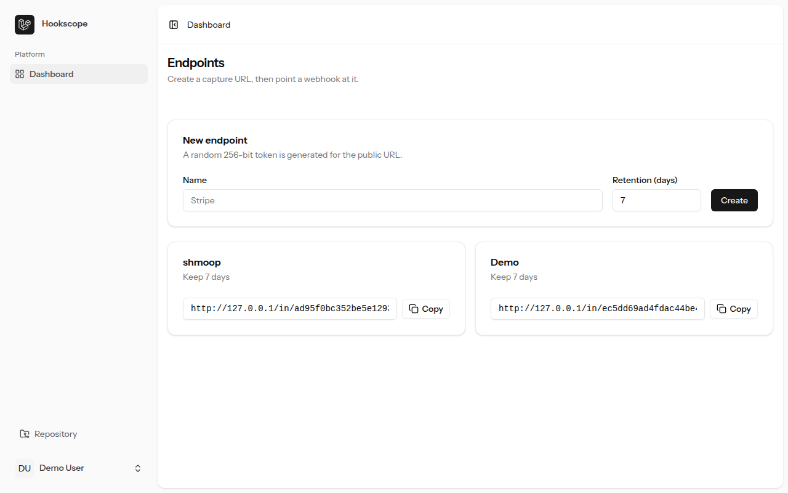
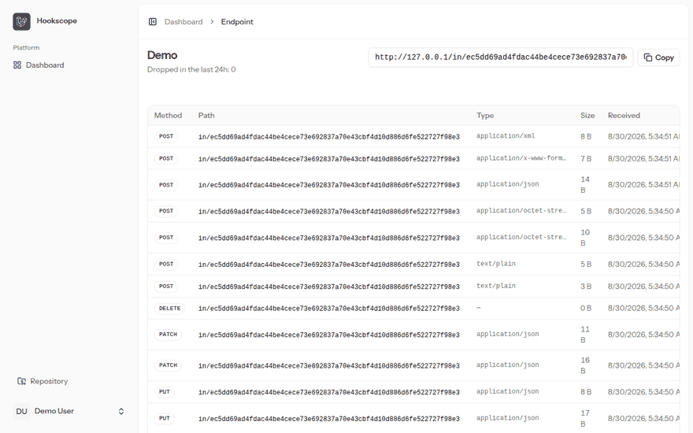
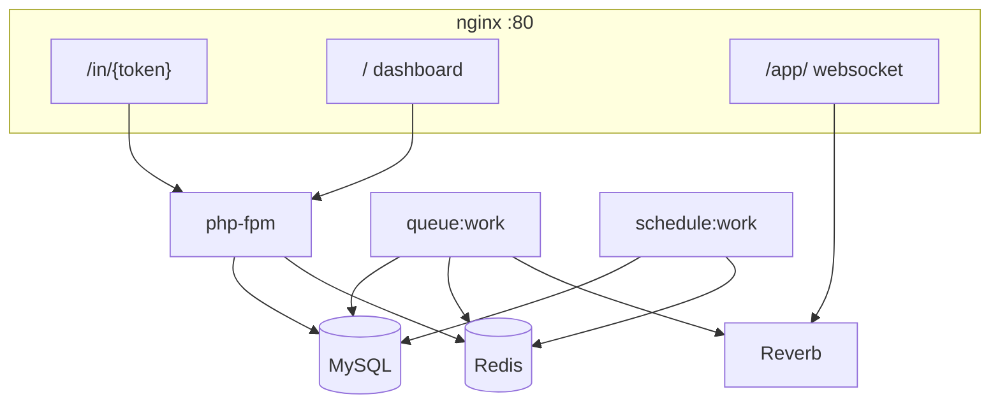

# Hookscope

Self-hosted webhook inspector and replayer. Unlike webhook.site, RequestBin, Beeceptor, or Hookdeck, **you keep the data** — ops-shaped capture, replay, and retention on your own box.

This is also a reference Laravel 13 application (Inertia 3, Vue 3, Pest, Larastan level 7).

**The clone-and-run path is verified in CI on every PR.** [`docker-smoke.yml`](.github/workflows/docker-smoke.yml) boots `compose.yaml` with no `.env`, seeds the demo user, and drives real traffic through nginx — including the 413 JSON that Pest cannot see.



`hookscope:demo-traffic` on the clone-and-run stack (`compose.yaml` / `queue:work`):



## Quickstart

```bash
git clone https://github.com/32thePharaoh/hookscope.git
cd hookscope
docker compose up -d --wait
```

App: http://localhost · health: http://localhost/up

Demo login: `demo@hookscope.test` / `password`

```bash
docker compose exec app php artisan hookscope:demo-traffic
```

That command must run inside the app container so requests go through nginx (`http://nginx`), not php-fpm. No `.env` step: `compose.yaml` builds everything it needs, generates `APP_KEY` on first boot, and seeds the demo user.

`REVERB_APP_SECRET` defaults to `hookscope-reverb-secret`. Change it before exposing the stack: set `REVERB_APP_SECRET` in the environment Compose interpolates (or in a Compose `env_file`). It never goes to the browser; `REVERB_APP_KEY` is the public id.

### Local development

```bash
docker compose -f compose.yaml -f compose.dev.yaml up -d --wait
```

Bind-mounts your checkout and runs Vite with HMR, so it expects `composer install` and `npm install` on the host first. The overlay uses `queue:listen`; clone-and-run and the GIF use `compose.yaml` (`queue:work`).

## Architecture



Capture persists first, then dispatches. Replay runs on the worker through the SSRF guard. The scheduler runs `hookscope:prune` hourly.

## Security

- **Bodies** are `longblob` plus `body_encoding`. **Headers** are JSON; non-UTF-8 values are stored as `{encoding: base64, value: ...}`. The `content_type` column is **not** lossless — invalid UTF-8 is replaced with `?` so it can live in a text column. The byte-exact Content-Type is in the headers JSON. Replay uses that JSON, not the column.
- **Default header strip is a denylist**, not a complete signature filter. Off unless opted in: `Authorization`, `Cookie`, `Proxy-Authorization`, `Stripe-Signature`, `X-Hub-Signature`, `X-Hub-Signature-256`, `X-Api-Key`, `Api-Key`. Unlisted signature headers (`X-Shopify-Hmac-Sha256`, `X-Slack-Signature`, `X-Amz-Security-Token`, …) **forward by default**. The replay row's `forwarded_headers` is the audit trail of what actually went out.
- **SSRF:** resolve the host, reject every forbidden address, pin with `CURLOPT_RESOLVE` as `host:port:ip` (the URL's port), redirects off. Blocked: loopback, RFC1918, link-local, CGNAT `100.64.0.0/10`, multicast, IPv4-mapped `::ffff:`, IPv4-compatible `::a.b.c.d`, NAT64 `64:ff9b::/96`, 6to4 `2002::/16`, ULA `fc00::/7`, site-local `fec0::/10`, plus encoded IPv4 forms (decimal/octal/hex). `HOOKSCOPE_ALLOW_PRIVATE_TARGETS` is the local-demo hatch and is **off** in `compose.yaml`.
- **The demo login is a published credential.** First boot seeds `demo@hookscope.test` / `password` on every install. Delete that user or change its password before exposing the stack — it is a dashboard login, not just a demo fixture.
- **Capture tokens sit in the URL**, so they appear in nginx access logs. Tokens are 256-bit random hex, not sequential. Fine for a self-hosted tool; do not put this on a shared reverse proxy log you treat as public.
- **Capture `/in/{token}` is session-free** (no cookies, not on the `web` stack). nginx `client_max_body_size 1m` returns JSON 413, and a Laravel middleware backstops every method. PHP's `post_max_size` sits _above_ the nginx cap on purpose and only governs POST, so it is not what guards raw PUT or PATCH bodies. Per-token throttle is 120/min, global 600/min.
- **Retention** deletes on `received_at` (indexed) with `chunkById`, and cascades replays.

## Tests

- [](https://github.com/32thePharaoh/hookscope/actions/workflows/tests.yml) — Pint, Larastan **level 7** (app and `tests/`), Pest against MySQL. This badge is `tests.yml`.
- [`docker-smoke.yml`](.github/workflows/docker-smoke.yml) is the clone-and-run job. Isolated so a slow container run cannot red-badge the repo.

License: MIT
